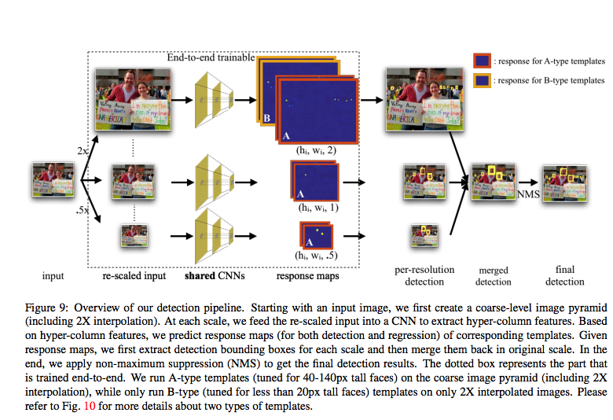
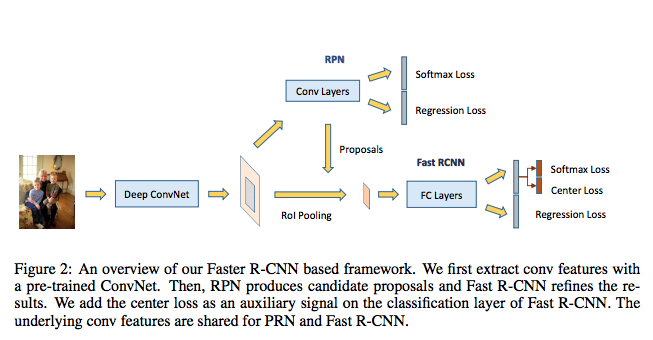

Title: Result on Face Detection
Slug: result-on-face-detection
Date: 2018-08-24 12:29:05
Tags: Face Detection, TUTORIAL
Author: Quang Nguyen
Category: tutorial
TopPost: no

# Benchmarks

## Validation
Methods                | easy | medium | hard | AFW   | Pascal
-----------------------|------|--------|------|-------|--------
Scale Face Val  | 86.8 | 86.7   | 77.2 | _   |_
SSH (Pyramid) Val      | 93.1 | 92.1   | 84.5 | _     | 98.27
HR Val                 | 91.9 | 90.8   | 82.3 | _     | _
Face R-CNN Val         | 93.8 | 92.2   | 82.9 | _     | _
Face R-FCN Val         | 94.7 | 93.5   | 87.4 | _     | _
FAN Val                | 95.3 | 94.2   | 88.8 | _     | _
Seeing Small Faces Val | 94.9 | 93.3   | 86.1 | 99.85 | 99.23
SFD Val                | 93.7 | 92.4   | 85.2 | 99.85 | 98.49

## Test 
Methods                 | easy | medium | hard | AFW   | Pascal
------------------------|------|--------|------|-------|-------
Scale Face Test         | 86.7 | 86.6   | 76.4 | _     |
HR Test                 | 91.5 | 90.2   | 81.3 | _     | _
Face R-CNN Test         | 93.2 | 91.6   | 82.7 | _     | _
SSH (Pyramid) Test      | 92.7 | 91.5   | 84.4 | _     | _
SFD Test                | 92.8 | 91.3   | 84.0 | _     | _
Face R-FCN Test         | 94.3 | 93.1   | 87.6 | _     | _
Seeing Small Faces Test | 94.9 | 93.5   | 86.5 | 99.85 | 99.23

# Methods
## HR - Finding Tiny Faces
Finding Tiny Faces. IEEE Conference on Computer Vision and 
Pattern Recognition (CVPR), 2017. 

Peiyun Hu, Deva Ramanan
Robotics Institute
Carnegie Mellon University

https://arxiv.org/pdf/1612.04402v1.pdf

**Result**
Methods | easy | medium | hard | AFW | Pascal
--------|------|--------|------|-----|--------
HR Val  | 91.9 | 90.8   | 82.3 | _   | _
HR Test | 91.5 | 90.2   | 81.3 | _   | _

**Implementation**

* For the shared CNNs, we experimented with three different architectures: ResNet101, ResNet50, and VGG16
* Positive examples IoU > 0.7
* Negative examples < 0.3 

**Contribution**
1. We provide an in-depth analysis of image resolution, object scale, and spatial context for the purposes of finding small faces. 

2. We demonstrate stateof-the-art results on massively-benchmarked face datasets (FDDB and WIDER FACE). In particular, when compared to prior art on WIDER FACE, our results reduce error by a factor of 2 (our models produce an AP of 81% while prior art ranges from 29-64%).

## Face R-CNN
Hao Wang Zhifeng Li∗ Xing Ji Yitong Wang
Tencent AI Lab, China

Face R-CNN. arXiv preprint arXiv:1706.01061, 2017. 

Paper:  https://arxiv.org/pdf/1706.01061.pdf

**Result**
Methods         | easy | medium | hard | AFW | Pascal
----------------|------|--------|------|-----|--------
Face R-CNN Val  | 93.8 | 92.2   | 82.9 | _   | _
Face R-CNN Test | 93.2 | 91.6   | 82.7 | _   | _

**Implementations**

* VGG19 with ImageNet pretrained model
* Positive examples IoU > 0.5
* Negative examples 0.1 < IoU < 0.5 
* IoU of NMS = 0.7

**Contribution**
The major contributions of this work are summarized as follows:

1. Considering the specific property of face detection, we propose a Faster R-CNN based approach
called Face R-CNN for face detection by integrating several newly developed techniques including
center loss, online hard example mining, and multi-scale training.
2. The proposed approach differs from the available Faster R-CNN based face detection methods.
First, this is the first attempt to use the center loss to reduce the large intra-class variations in face
detection. Second, the use of online hard example mining in our approach differs from the others.
By appropriately setting the ratio between positive hard samples and negative hard samples, the
combination of OHEM and center loss can lead to better performance.
3. The proposed approach consistently obtains superior performance over the state-of-the-arts on
two public-domain face detection benchmarks (WIDER FACE dataset [25] and FDDB dataset [28]).

## ScaleFace
Face Detection through Scale-Friendly Deep Convolutional Networks. arXiv preprint arXiv:1706.02863, 2017. 

**Result**

Methods         | easy | medium | hard | AFW | Pascal
----------------|------|--------|------|-----|-------
Scale Face Val  | 86.8 | 86.7   | 77.2 | _   |
Scale Face Test | 86.7 | 86.6   | 76.4 | _   |

**Implementation**

**Contribution**
* Runtime NVIDIA Titan X GPU
900 x 1300 (7.1 fps)

## SSH
SSH: Single Stage Headless Face Detector. IEEE International 
Conference on Computer Vision (ICCV), 2017.
Mahyar Najibi* Pouya Samangouei* Rama Chellappa Larry S. Davis

University of Maryland

https://arxiv.org/pdf/1708.03979.pdf 

**Result**
Methods            | easy | medium | hard | AFW | Pascal
-------------------|------|--------|------|-----|--------
SSH (Pyramid) Val  | 93.1 | 92.1   | 84.5 | _   | 98.27
SSH (Pyramid) Test | 92.7 | 91.5   | 84.4 | _   | _

**Implementation**

* Positive examples IoU > 0.5, This is in contrast to the methods based on Faster RCNN which assign to each ground-truth at least one anchor
with the highest IoU.

* Negative examples IoU < 0.3

**Contribution**
* That is, it is able to achieve state-of-the-art results while removing the “head” of its underlying classification network – i.e. all fully connected layers in the VGG-16 which contains a large number of parameters. Additionally, instead of relying on an image pyramid to detect faces with various scales, SSH is scale-invariant by design.

* SSH beats the ResNet-101- based state-of-the-art on the WIDER dataset. Even though, unlike the current state-of-the-art, SSH does not use an image
pyramid and is 5X faster. Moreover, if an image pyramid is deployed, our light-weight network achieves stateof-the-art on all subsets of the WIDER dataset, improving the AP by 2.5%. 

## SFD
S³FD: Single Shot Scale-invariant Face Detector. IEEE International Conference on Computer Vision (ICCV), 2017. 
**Result**
Methods  | easy | medium | hard | AFW   | Pascal
---------|------|--------|------|-------|--------
SFD Val  | 93.7 | 92.4   | 85.2 | 99.85 | 98.49
SFD Test | 92.8 | 91.3   | 84.0 | _     | _

Runtime 
* The speed using Titan X 36 FPS  VGA-resolution (640 x 480)

**Implementation**

* `Loss = Cls_Loss * 4 + Loc_Loss`
* Negatives : Positives = 3 : 1 
**Contribution**

1. Proposing a scale-equitable face detection framework
with a wide range of anchor-associated layers and a
series of reasonable anchor scales so as to handle different
scales of faces well.
2. Presenting a scale compensation anchor matching
strategy to improve the recall rate of small faces.
3. Introducing a max-out background label to reduce the
high false positive rate of small faces.
4. Achieving state-of-the-art results on AFW, PASCAL
face, FDDB and WIDER FACE with real-time speed.
## Face R-FCN 
Detecting Faces Using Region-based Fully
Convolutional Networks
**Result**
Methods         | easy | medium | hard | AFW | Pascal
----------------|------|--------|------|-----|--------
Face R-FCN Val  | 94.7 | 93.5   | 87.4 | _   | _
Face R-FCN Test | 94.3 | 93.1   | 87.6 | _   | _

**Implementation**

* Resnet101 as base network

* These anchors then map to the original image to calculate the IoU scores
with the ground truth for further picking up with following rules: First, the anchors with highest IoU score are strictly kept as positive; Second, the anchors with IoU score above 0.7 are assigned as positive; Third, If the anchors have IoU score that is lower than 0.3, they are marked as negative.
The R-FCN is then trained on the processed anchors (proposals) where the positive samples and negative samples are defined as IoU greater than 0.5 and between 0.1 and 0.5 respectively.

* In the testing stage, multi-scale testing is performed by scale image into
an image pyramid for better detecting on both tiny and general faces.

**Contribution**

## MSCNN
A Unified Multi-scale Deep Convolutional Neural Network for Fast Object Detection, European Conference on Computer Vision (ECCV), 2016. 

**Result**
Methods         | easy | medium | hard | AFW | Pascal
----------------|------|--------|------|-----|--------

**Implementation**

**Contribution**

## FAN 
Face Attention Network: An Effective Face Detector for the Occluded Faces. arXiv preprint arXiv:1711.07246, 2017. 

https://arxiv.org/pdf/1711.07246.pdf

**Result**

Methods  | easy | medium | hard | AFW | Pascal
---------|------|--------|------|-----|--------
FAN Val  | 95.3 | 94.2   | 88.8 | _   | _
FAN Test | 94.6 | 93.6   | 88.5 | _   | _

**Implementation**

**Contribution**
In summary, there are three contributions in our paper.
* We propose a anchor-level attention, which can well address the occlusion issue in the face detection task. One illustrative example for our detection results in the crowd case can be found in Figure 1.
* A practical baseline setting is introduced based on the one-shot RetinaNet detector, which obtains comparable performance with fast computation speed.
* Our FAN which integrates our reproduced one-shot RetinaNet and anchor-level attention significantly outperforms state-of-art detectors on the popular face detection benchmarks including WiderFace [34] and
MAFA [6], especially in the occluded cases like MAFA.

## Seeing Small Face CVPR 2018
Seeing Small Faces from Robust Anchor's Perspective. IEEE Conference on Computer Vision and Pattern Recognition (CVPR), 2018. 
**Result**
Methods         | easy | medium | hard | AFW | Pascal
----------------|------|--------|------|-----|--------
Seeing Small Faces Val  | 94.9 | 93.3   | 86.1 | 99.85  | 99.23
Seeing Small Faces Test | 94.9 | 93.5   | 86.5 | 99.85   | 99.23

* Runtime speed on single NVIDIA Titan X GPU with batch size 1:
    * 85% on size 1400x1800 = 1s
    * 75.7% on size 600x1000 = 0.2s
**Implementation**

**Contribution**

## PyramidBox
PyramidBox: A Context-assisted Single Shot Face Detector. arXiv preprint arXiv:1803.07737, 2018. 
**Result**
Methods         | easy | medium | hard | AFW | Pascal
----------------|------|--------|------|-----|--------

**Implementation**

**Contribution**
